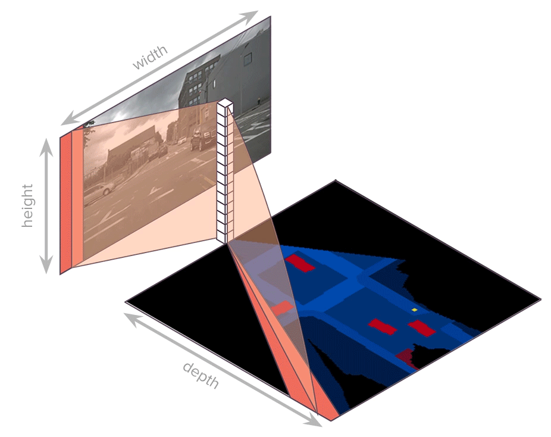

# Translating Images into Maps
#### Avishkar Saha, Oscar Mendez Maldonado, Chris Russell and Richard Bowden

This is the official code for the paper [Translating Images Into Maps](https://arxiv.org/abs/2110.00966) presented at ICRA 2022.

### Translating Images into Maps
<div>
</img>
</div>
<br />

### Setup
The code was written using python 3.7. 
The following libraries are the minimal required for this repo: 
```python
pytorch
cv2
numpy
pickle
pyquaternion
shapely
lmdb
```

### Data
The official nuScenes data will be required to train the entire model. 
But for convenience, we provide the nuScenes mini dataset wrapped into 
lmdb's, they can be downladed from either of the links below:
```
https://www.icloud.com/iclouddrive/0aaSjW59DEqgUDKyy1uw0iSVg#nuscenes%5Fdata

https://drive.google.com/drive/folders/1-1dZXeHnPiuqX-w8ruJHqfxBuMYMONRT?usp=share_link
```

The contents of this folder need to be unzipped and placed in a folder, create the folder
as follows:
```
cd translating-images-into-maps
mkdir nuscenes_data
```

This contains the ground truth maps which have already been generated for
the mini dataset, the input images and intrinsics.

### Using the code:
To train a model with the configuration in the paper, simply run:
```bash
python train.py  
```

### Pretrained model
Pretrained models and their configs required to load/train them can be downloaded from here:
````
https://www.icloud.com/iclouddrive/041FdACyj8m0pM4L383luzZJg#tiim_checkpoints
````


### Citation
If you find this code useful, please cite the following papers:
```
@inproceedings{saha2022translating,
  title={Translating Images into Maps},
  author={Saha, Avishkar and Mendez, Oscar and Russell, Chris and Bowden, Richard},
  booktitle={2022 IEEE International Conference on Robotics and Automation (ICRA)},
  year={2022},
  organization={IEEE}
}
@inproceedings{saha2021enabling,
  title={Enabling spatio-temporal aggregation in birds-eye-view vehicle estimation},
  author={Saha, Avishkar and Mendez, Oscar and Russell, Chris and Bowden, Richard},
  booktitle={2021 IEEE International Conference on Robotics and Automation (ICRA)},
  pages={5133--5139},
  year={2021},
  organization={IEEE}
}
@inproceedings{saha2022pedestrian,
  title={" The Pedestrian next to the Lamppost" Adaptive Object Graphs for Better Instantaneous Mapping},
  author={Saha, Avishkar and Mendez, Oscar and Russell, Chris and Bowden, Richard},
  booktitle={Proceedings of the IEEE/CVF Conference on Computer Vision and Pattern Recognition},
  pages={19528--19537},
  year={2022}
}
```
